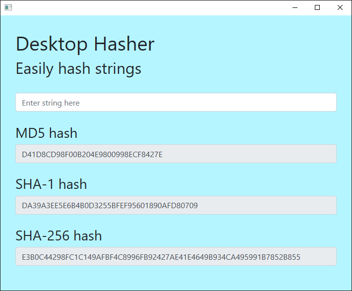

# Desktop-Hasher

An example of using the Rust-Elm-Template to create a desktop application to hash strings.

-----

# Rust-Elm-Template

A template for creating web-based desktop applications (similar to Electron, but not Electron).

It uses native WebView, in particular WebKit for Linux and macOS, and MSHTML on Windows.

Heavily inspired by [this kanban app](https://github.com/huytd/kanban-app).

## Things you'll need
Non-NixOS users:
- Elm, which can be downloaded [here](https://guide.elm-lang.org/install.html)
- Cargo, which can be downloaded [here](https://doc.rust-lang.org/cargo/getting-started/installation.html)

NixOS users:
- Nothing: the `./compile` file should source everything in one go!

## Setting up your project
There are a few things to do to set this project up as your own, but trust me, it's really straight forward, all you have to do is change the contents of the `Cargo.toml` file:

- `name` -> The name of your project (and output executable)
- `description` -> A description of your project
- `authors` -> You probably don't want my name plastered over your project

## Building the application
If you're on NixOS, you're in luck! Just run `./compile` in this root directory and it'll compile everything (The Elm code and the binary written in Rust). If you're not on NixOS, you're going to have to do a bit of work:

- Navigate to the `/www` folder
- Run `./compile-elm` to compile the elm code
- Return back to the root folder
- Run `cargo build --release`

## Running the application
Head down to `target/release/<your_project_name>` and run it!
